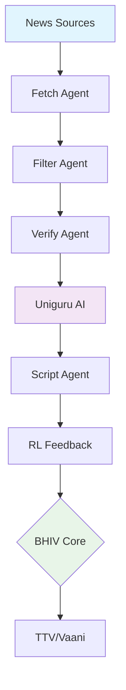

# News AI Backend + RL Automation Sprint

## Overview

A comprehensive news processing backend that connects Akash's pipeline with Uniguru AI services, featuring reinforcement learning feedback loops and multi-agent orchestration.

## Sprint Goals

### Day 1: System Setup + Uniguru Connect
- Modularize FastAPI microservices
- Set up MongoDB Atlas
- Integrate Uniguru endpoints (classification, sentiment, summarization)
- Validate with 5 sample news items

### Day 1-2: Agent Registry + MCP Core
- Build AgentRegistry (Fetch, Filter, Verify, Script, RLFeedback)
- Async task routing and schema
- Connect to BHIV Core stub

### Day 2-3: RL Feedback Loop
- Implement reward loop (tone + engagement + quality)
- Auto-reroute low-score outputs (< 0.6 threshold)
- Log metrics and correction %

### Day 3-4: LangGraph Automator + AutoPipeline
- Build LangGraph flow: Fetch → Verify → Script → Feedback
- Automate correction using MCP automators
- Test with 10 mixed-category stories

### Day 4-5: Integration with BHIV + Core
- Connect pipeline to BHIV endpoints
- Enable WebSocket streaming
- Verify JSON compatibility with Seeya orchestration

## Folder Structure

```
news/
├── unified_tools_backend/          # Main FastAPI backend
│   ├── app/                        # Application modules
│   │   ├── api/main.py            # FastAPI routes & endpoints
│   │   ├── core/database.py       # MongoDB Atlas connection
│   │   └── services/uniguru.py    # Uniguru AI client
│   ├── agents/                     # MCP Agent Registry
│   │   └── agent_registry.py      # 5 specialized agents
│   ├── rl/                        # Reinforcement Learning
│   │   └── feedback_service.py    # Reward scoring & auto-correction
│   ├── pipeline/                   # LangGraph Automation
│   │   └── automator.py           # Fetch→Verify→Script→Feedback flow
│   ├── bhiv_connector/             # BHIV Core Integration
│   │   └── bhiv_service.py        # Push API & WebSocket streaming
│   ├── models/                     # Pydantic models
│   ├── tests/                      # Test suite
│   ├── main.py                    # Application entry point
│   └── requirements.txt           # Python dependencies
├── docs/                          # Documentation
└── README.md                      # This file
```

## How to Run

### Prerequisites
- Python 3.8+
- MongoDB Atlas account
- Uniguru API credentials

### Installation

1. Clone the repository:
```bash
git clone https://github.com/noopurdhondsekar12/News-AI.git
cd News-AI/news
```

2. Install dependencies:
```bash
pip install -r unified_tools_backend/requirements.txt
```

3. Set environment variables:
```bash
export MONGODB_URL="your_mongodb_atlas_connection_string"
export UNIGURU_API_KEY="your_uniguru_api_key"
export UNIGURU_BASE_URL="https://api.uniguru.com"
export BHIV_CORE_URL="http://localhost:8080"  # optional
```

4. Run the FastAPI server:
```bash
cd unified_tools_backend
uvicorn main:app --host 0.0.0.0 --port 8000 --reload
```

The API will be available at `http://localhost:8000` with automatic docs at `http://localhost:8000/docs`.

## Components

### Uniguru Integration
- **Location**: `unified_tools_backend/app/services/uniguru.py`
- **Features**: Classification, sentiment analysis, text summarization
- **Integration**: REST API calls to Uniguru AI services

### AgentRegistry
- **Location**: `unified_tools_backend/agents/agent_registry.py`
- **Agents**: Fetch, Filter, Verify, Script, RLFeedback (5 total)
- **Features**: Async task processing, priority queues, load balancing

### RL Feedback Loop
- **Location**: `unified_tools_backend/rl/feedback_service.py`
- **Reward Function**: Tone (30%) + Engagement (40%) + Quality (30%)
- **Auto-Correction**: Re-summarize when score < 0.6

### LangGraph Pipeline
- **Location**: `unified_tools_backend/pipeline/automator.py`
- **Workflow**: Fetch → Verify → Script → Feedback → Correction
- **Features**: State management, error recovery, conditional retry

### BHIV Integration
- **Location**: `unified_tools_backend/bhiv_connector/bhiv_service.py`
- **Features**: Push API, WebSocket streaming, Seeya JSON format
- **Matrix Testing**: 3×3 channel-avatar combinations

## Architecture Diagram

See [docs/architecture.txt](docs/architecture.txt) for the complete system architecture diagram.



## API Endpoints

- `GET /` - System overview
- `POST /api/process-news` - Complete news processing pipeline
- `GET /api/agents` - List MCP agents
- `POST /api/rl/feedback` - Calculate reward scores
- `POST /api/bhiv/push` - Push to BHIV
- `GET /api/health` - System health check

## Testing

Run the comprehensive test suite:
```bash
python unified_tools_backend/tests/test_sprint_complete.py
```

## License

Part of the Blackhole Infiverse LLP initiative.